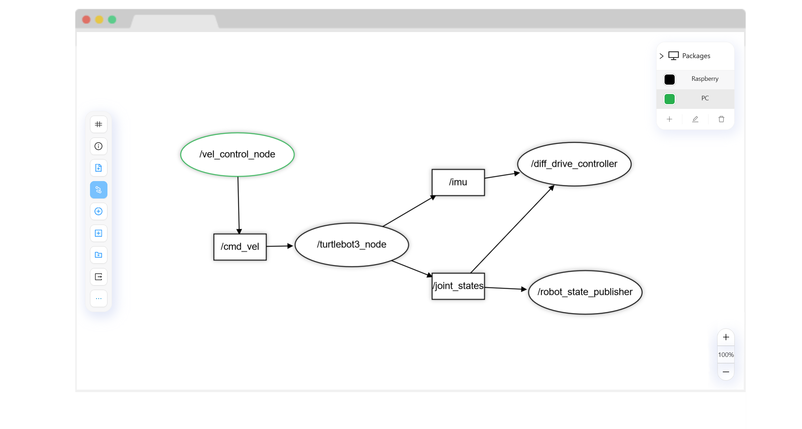

<h1>ROSGen</h1>

Rapid ROS2 network code-generation and visualization, through a rqt_graph-like interface. Running on your <a href="https://franciscobarca.github.io/ROSgen/">browser</a> with the power of React and Konva.js.
<ul>
<li>ROS2, is the default platform of choice for open-source robot development. However, the breadth and depth of existing documentation can be daunting for the ROS beginner.</li>
</ul><ul>
<li>This projects aims to lower the barrier of entry to ROS2, enabling a less code intensive workflow while the user is still familiarizing himself with key aspects of ROS 2.</li>
</ul><ul>	

</ul><h2>Usage</h2> 

<ul>
<li>Select the desired tool on the left bar.</li>
<li>Double click on an empty space and write to create the component.</li>
<li>Click the connection tool and then click the node and topic to connect.</li>
<li>Click on a component (without the connection tool) to see it's details.</li>
<li>Use the top right menu too add and switch pakages (package to be used marked with dark gray)</li>
</ul><h2>Technologies Used</li>

</h2>

<ul>
<li>React</li>
</ul><ul>
<li>Konva.js</li>
</ul><ul>
<li>Ant Design</li>
</ul><h2>Features</h2>

<ul>
<li>Create nodes and topics.</li>
</ul><ul>
<li>Create a complex Pub-Sub system.</li>
</ul><ul>
<li>Manage your network between different packages to create distributed networks.</li>
</ul><ul>
<li>Export your created network to Python code to further develop.</li>
</ul><h2>Setup</h2>

It is recommended to be used through <a href="https://franciscobarca.github.io/ROSgen/">Github Pages</a>, but you are free to download the sourcecode to improve or add features.
<h5>Steps</h5><ul>
<li>Download or fork the repo.</li>
</ul><ul>
<li>Install the requiered dependencies through npm. (currently requires --force)</li>
</ul><ul>
<li>Start a deployment server through npm start or create a</li>
</ul><h2>Project Status</h2>

In Progress, although not in active development.
<h2>Improvements</h2>

<ul>
<li>Switch to a React state management library to improve performance and codebase mantainability.</li>
</ul><h2>Features that can be added</h2>

<ul>
<li>Add Services</li>
</ul><ul>
<li>Add Actions</li>
</ul><ul>
<li>Custom topic types</li>
</ul><h2>Acknowledgement</h2>

<ul>
<li>This project was inspired by the rqt_graph visualization plugin and VPL's.</li>
</ul><h2>Contact</h2>

<!--  -->
<!--  -->

Any issues / suggestions / comments / questions, please contact me at

